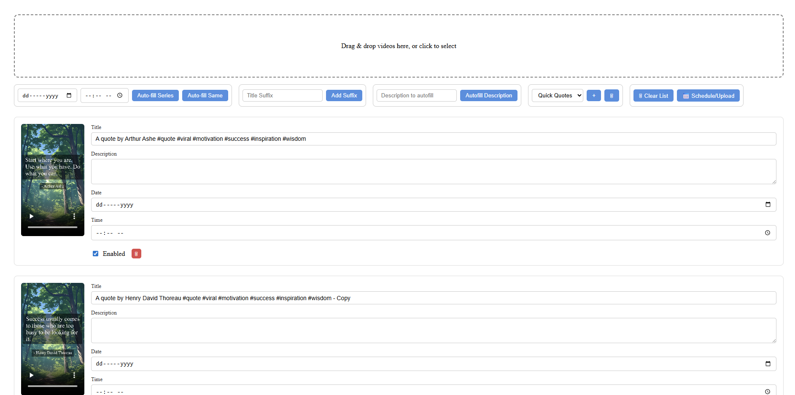

> [!NOTE]
> This App Allow You To Post Video On Youtube In Bulk Efficiently, with features like:
> - Multiple Account Management
> - Video Scheduling
> - Video Preview
> - Bulk Upload

## UI


## Setup & Run Instructions for OS other than Windows
### 1. Clone the repository
```
git clone https://github.com/Ravish-Vishwakarma/Youtube_Bulk_Upload.git
cd Youtube_Bulk_Upload
```
### 2. Create a virtual environment
```
python -m venv .venv
```
### 3. Activate the virtual environment - Windows:
```
.venv\Scripts\activate
```
### 4. Install dependencies
```
pip install -r requirements.txt
```
### 5. Add your client_secrets.json
Follow the instructions Above to create a Google API client_secrets.json file. 

### 6. Run the app
Execute the bat file present in the source folder -> run-app.bat
---

> [!CAUTION]  
> Make sure you replace the dummy key or the whole file `client_secrets.json` with your own Google API credentials for YouTube. (Make sure the file name is same)

## How to create `client_secret.json`, Google APIs (YouTube)

### 1. Go to Google Cloud Console
- Open: [https://console.cloud.google.com/](https://console.cloud.google.com/)  
- Log in with your Google account.

### 2. Create a new project
- Click **“Select a project” → “New Project”**  
- Name it (e.g., `YouTubeUploader`)  
- Click **Create**

### 3. Enable YouTube Data API
- Go to **APIs & Services → Library**  
- Search for **YouTube Data API v3**  
- Click **Enable**

### 4. Create OAuth 2.0 Credentials
- Go to **APIs & Services → Credentials**  
- Click **Create Credentials → OAuth client ID**  
- If prompted, configure **OAuth consent screen**:
  - User type: **External**  
  - Fill app name, email, etc., then **Save**  
- For OAuth client ID creation:
  - Application type: **Desktop app**  
  - Name: e.g., `YouTube Desktop`  
  - Click **Create**

### 5. Download `client_secret.json`
- Click **Download JSON**  
- Save it as `client_secret.json` in your backend folder.  
- Example content:
```json
{
  "installed": {
    "client_id": "YOUR_client_id",
    "project_id": "YOUR_project_id",
    "auth_uri": "https://accounts.google.com/o/oauth2/auth",
    "token_uri": "https://oauth2.googleapis.com/token",
    "auth_provider_x509_cert_url": "https://www.googleapis.com/oauth2/v1/certs",
    "client_secret": "YOUR_client_secret",
    "redirect_uris": [
      "http://localhost"
    ]
  }
}
```


